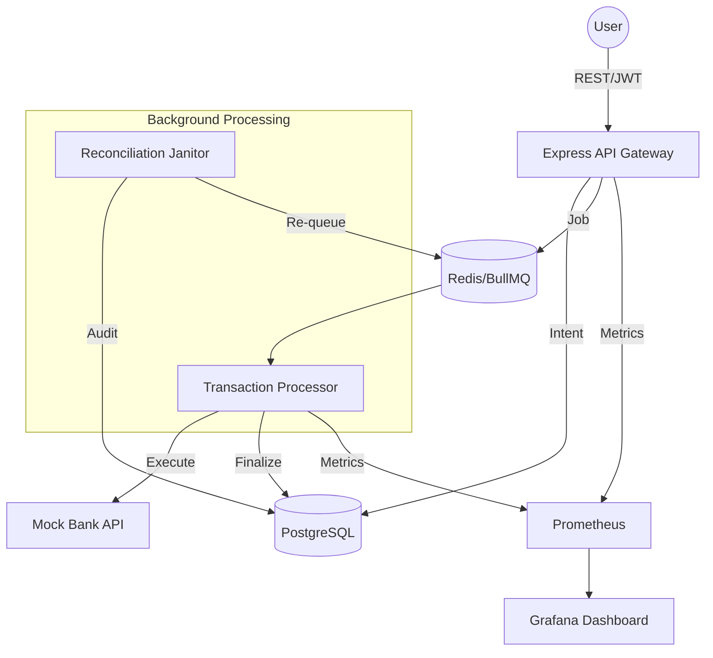

# 🚀 Kizo — Resilient Digital Wallet System

> **Not a tutorial app. Not a CRUD demo.**
> Kizo is a real-world digital wallet system designed to demonstrate scalable, observable, and failure-tolerant architecture.

[]()
[]()

---

## 🌍 Live Demo

- **Landing Page (Astro):** [kizo.devaman.space](https://kizo.devaman.space)
- **Web Application (React):** [app.kizo.devaman.space](https://app.kizo.devaman.space)
- **Monitoring (Grafana)**: Internal (Metrics: P99 Latency, Error Rates, Worker Health)

---

## 🎯 Why Kizo Exists

Most "full-stack projects" stop at basic auth and happy-path flows. Kizo goes further. It is built to mirror how real companies run financial systems—handling concurrency, ensuring consistency, and planning for failure.

This project represents my approach as a Full-Stack Engineer: **breaking systems, fixing bottlenecks, making trade-offs, and prioritizing correctness over feature bloat.**

### 🧠 Engineering Philosophy

- **Correctness > Features:** Idempotency and data consistency take precedence over UI flashiness.
- **Observability First:** Logging and metrics are architectural requirements, not afterthoughts.
- **Simple First, Extensible Later:** No premature optimization, but clear pathways for V2 scaling.
- **AI-Assisted, Human-Architected:** I use tools like ChatGPT/v0.dev to accelerate coding, but **all architectural decisions, validations, and edge case handling are mine.**

---

## 🌐 System Architecture

Designed with a clear separation of concerns, optimized for SEO on the public face and performance on the dashboard.



---

## 🏗️ Tech Stack

### Backend & Distributed System

- **Node.js + Express:** Utilizes TraceID propagation across the API and Workers for end-to-end debugging.
- **BullMQ + Redis**: Offloads settlement logic to background workers, ensuring the API remains responsive (low P50 latency) even when the bank is slow.
- **Prisma + Raw SQL:** Prisma for developer velocity; Raw SQL for complex ledger aggregations and balance swaps where performance is critical.
- **Auth:** JWT + Refresh Token rotation with RBAC.
- **PostgreSQL:** Relational data for users and wallets.
- **TypeScript:** Type safety across the stack.

### Frontend

- **React + TypeScript:** Main application dashboard.
- **Astro:** Static/SSR hybrid for high-performance, SEO-friendly landing pages.
- **Redux Toolkit + Axios:** State management and networking.
- **Optimization:** Lazy loading & route-based code splitting.

### Infra & Tooling

- **GitHub Actions:** CI/CD pipelines.
- **Docker:** Containerization (selective usage).
- **OpenAPI:** Standardized API documentation.
- **Testing:** Unit + Integration testing strategy.

### Observability (Proof)

- **Prometheus Histograms**: Tracks P99 tail latency to catch the "unlucky" users affected by bank delays.
- **Loki + Pino**: Structured logging for high-speed log aggregation.
- **Grafana**: Custom "Health Dashboard" monitoring transaction success rates and system burn rate.

---

## 🔍 Key Engineering Decisions & Trade-offs

### 1. Raw SQL vs. ORM

While Prisma is used for schema management and basic queries, I explicitly use **Raw SQL** for complex dashboard aggregations and financial transactions. This ensures control over the generated queries and performance optimization that ORMs often obscure.

### 2. Idempotent Money Flows

The system implements idempotency keys to prevent double-spending or duplicate transactions during network retries—a critical requirement for any fintech application.

### 3. V1 vs. V2 Strategy

I avoided over-engineering the V1. For example, message queues (Redis/BullMQ) are reserved for the V2 roadmap to handle bank downtime scenarios. V1 focuses on strong ACID compliance within the database.

---

## 🧩 Monorepo Structure

```bash
kizo/
├── apps/
│   ├── kizo-api/       # API Gateway & Auth
│   ├── kizo-processor/ # BullMQ Workers & Reconciliation logic
│   ├── kizo-web/       # React Dashboard (SPA)
│   └── kizo-landing/   # Astro Static Site (SEO)
├── docker/             # Container definitions
├── packages/           # Shared DB logic, Metrics, and Logger configs
├── load-tests/         # k6 stress scripts (50+ concurrent users)
└── README.md

```

---

## 🧪 Testing & Verification

- **Unit/Integration**: Vitest suite covering the "Wallet Muscle" (debit/credit logic).
- **Stress Testing**: Automated k6 scripts with pre-seeded JWT data to verify system throughput.
- **CI/CD**: GitHub Actions for automated linting, testing, and SSH-based deployment to the VM.

---

## 🧑‍💻 About Me

I’m a Full-Stack Developer who understands that code is a liability and correctness is an asset. I don't just build features; I build systems that are observable, testable, and resilient.
[Check out my portfolio](https://devaman.space)
