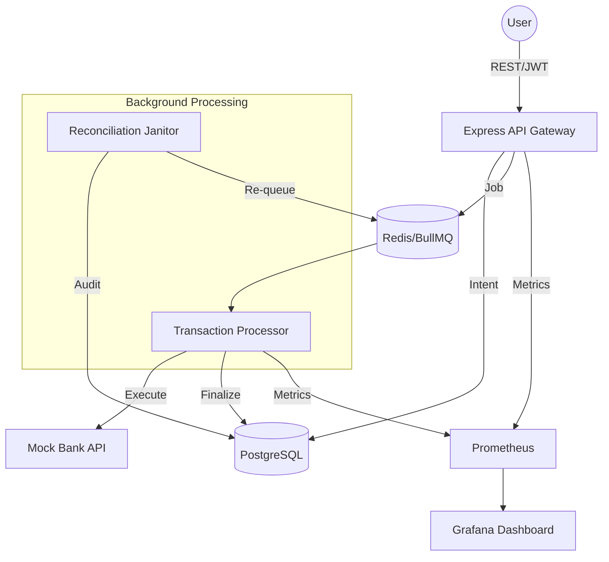

# 🚀 Kizo — Resilient Digital Wallet (Legacy Project)

High-performance personal fintech wallet built to explore concurrency, idempotency, observability, and failure tolerance in a full-stack monorepo.

## 🎯 Engineering Highlights

Most demo wallets stop at basic CRUD + auth. Kizo pushes further into the "Day 2" problems of financial engineering:

- **Financial Correctness:** Implements an ACID-compliant ledger using **PostgreSQL Row-Level Locking** (`SELECT FOR UPDATE`) and **Idempotency Keys** to prevent double-spending or duplicate processing on network retries.
- **Asynchronous Settlement:** Offloads heavy settlement logic to **BullMQ/Redis** workers. This keeps the API responsive (low P50 latency) even when processing a heavy volume of background transactions.
- **Stress Verified:** Validated via **k6** (100 VUs → 70+ RPS) with a **100% success rate** across 7,000+ requests, proving the stability of the transaction pipeline.
- **Bottleneck Analysis:** Identified Argon2 CPU contention (P99 3.41s) under load and documented architectural fixes (Session offloading to Redis, Rate Limiting, and Worker Scaling).

---

## 🏗️ Architecture Overview

Designed with a clear separation of concerns, optimized for SEO on the public face and performance on the dashboard.

---

## 🧪 Performance & Stress Test Results

The system was pushed to hardware saturation using **k6** to identify the "breaking point" and verify data integrity under fire.

**Final Load Profile:** 100 Concurrent VUs | 7,075 Total Requests | **100.00% Success Rate**

| Module             | Median Latency | P99 Latency | Result        |
| ------------------ | -------------- | ----------- | ------------- |
| **Auth (Argon2)**  | 1.74s          | **3.41s**   | 🟡 CPU Bound  |
| **Dashboard**      | 695ms          | **1.46s**   | 🟢 Stable     |
| **Payment (ACID)** | 892ms          | **2.11s**   | 🟢 Consistent |

> **Key Learning:** The high P99 in Auth is the "Argon2 Tax." In a production environment, I would decouple the Auth service to prevent CPU-intensive hashing from slowing down core business transactions (Noisy Neighbor effect).

---

## 🔑 Key Decisions & Trade-offs

- **Raw SQL vs. ORM:** While Prisma is used for schema management, I utilized **Raw SQL** for ledger aggregations and balance swaps. This ensures absolute control over query plans and avoids the overhead of ORM abstraction in high-concurrency paths.
- **Worker Concurrency:** Optimized the **BullMQ** worker factory to handle **50 concurrent jobs**. This shifted the bottleneck from software limits to hardware limits, clearing backlogs 50x faster than default settings.
- **Observability First:** Integrated **Prometheus** histograms to track **Tail Latency (P99)** rather than just averages, catching edge-case delays that affect "unlucky" users.

---

## 🛠️ Tech Stack

- **Backend:** Node.js, Express, TypeScript, Prisma (ORM), PostgreSQL.
- **Distributed:** Redis, BullMQ (Job Queueing).
- **Frontend:** React (Dashboard), Astro (SEO-friendly Landing Page).
- **Infrastructure:** Docker, Nginx, GitHub Actions (CI/CD), GCP.
- **Observability:** Prometheus, Grafana, Pino (Structured Logging).

---

## 📈 Resume Impact (Extracts)

- _"Engineered a resilient digital wallet handling **70+ RPS**; validated ACID compliance and Idempotency via **k6 stress testing** (100 VUs, 100% success rate)."_
- _"Scaled background processing throughput by **50x** by tuning **BullMQ concurrency** and optimizing PostgreSQL connection pooling."_
- _"Designed a secure authentication pipeline using **Argon2 with peppering** and JWT rotation, documenting architectural trade-offs for CPU-bound microservices."_

---

## 🧑‍💻 Legacy Note

Kizo is a legacy project where I established my core fintech engineering patterns. These lessons in **concurrency control** and **system resilience** are now being applied at enterprise scale in my current **Java Spring Boot Payroll Engine**.

Built by [Aman Kumar](https://devaman.space) • [LinkedIn](https://linkedin.com/in/yourprofile)
